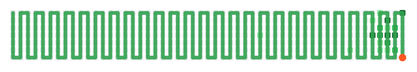

<h1 align="center">Hi , I'm Aniket Chaudhary</h1>
<h3 align="center">Backend / Distributed Systems Software Engineer | Rust • Node.js • Kafka</h3>

  
  
  
  
  
  

  
  

## 📌 Projects

**Kafka-Based Distributed Messaging System** — Rust, Tokio, Apache Kafka, WebSockets
- Real-time multi-channel delivery (WebSockets / SMS / email / polling fallback), async channels, persistence-backed delivery tracking, horizontal scaling via consumer groups + retry + fault handling.

**Solana Transaction Engine** — Rust, Solana, Jupiter Aggregator
- Optimized transaction routing; serialization/signing/submission pipeline with zero-copy patterns; wallet handling, token accounts, encrypted key management.

**Prometheus AI Agent Evaluation Task — Structural Retrofit Benchmark** — Python, Docker, JSON Schema, GitHub CI, RubricTask
- Seismic retrofit design benchmark with hidden grading fixtures, deterministic gradients, oracle solution scoring 1.0 under harness validation.

**EduStack – Multi-Tenant Learning Platform** — NestJS, Next.js, PostgreSQL, Prisma, AWS S3, Vercel
- 4-tier RBAC (Super Admin / Institute Admin / Teacher / Student), JWT + bcrypt, video learning w/ progress tracking, MCQ engine with auto-grading, live-class scheduling.
- Live: https://edustack-rouge.vercel.app

## 🛠️ Tech Stack

**Languages**

  
  
  
  
  
  

**Backend & Distributed Systems**

  
  
  
  
  
  
  
  
  
  

**Databases & Cloud**

  
  
  
  
  
  

**Frontend & Blockchain**

  
  
  
  
  
  

## 🐍 Contribution Snake

<picture>
  <source media="(prefers-color-scheme: dark)" srcset="dist/github-snake-dark.svg" />
  <source media="(prefers-color-scheme: light)" srcset="dist/github-snake.svg" />
  
</picture>

## ⚡ About Me

- 🔭 **Currently working on** — Backend & distributed systems (Rust / Node.js / Kafka), plus AI-agent evaluation infrastructure (Alignerr / Labelbox).
- 🧠 **Distributed Systems** — Event-driven architecture, Kafka consumer groups, async/non-blocking I/O, retry handling, fault tolerance, horizontal scaling.
- 🦀 **Blockchain** — Solana transaction infrastructure, Jupiter Aggregator routing, wallet handling, token accounts, encrypted key management.
- 🤖 **AI Evaluation** — RL task authoring, deterministic graders, hidden test fixtures, rubric-based scoring, Prometheus structural benchmarks.
- 💬 **Ask me about** — Rust, Kafka, distributed messaging, Solana, multi-tenant SaaS design.
- 🌱 **Currently exploring** — Solana smart contracts (Anchor) and advanced Rust async patterns.
- 📫 **Reach me** — caniket1307@gmail.com

 

 

  You can connect with me here —  
  
  

